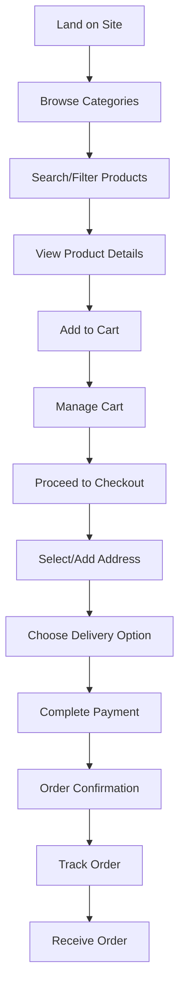

# V2 Customer User Flow Guide

## Overview
This guide provides a complete walkthrough of the customer journey from browsing to receiving orders, including all the APIs used at each step.

## Table of Contents
1. [Customer Journey Overview](#customer-journey-overview)
2. [Browsing Phase](#browsing-phase)
3. [Product Discovery Phase](#product-discovery-phase)
4. [Product Selection Phase](#product-selection-phase)
5. [Cart Management Phase](#cart-management-phase)
6. [Checkout Phase](#checkout-phase)
7. [Post-Purchase Phase](#post-purchase-phase)
8. [Guest vs Authenticated Flow](#guest-vs-authenticated-flow)
9. [Error Handling in Customer Flow](#error-handling-in-customer-flow)

## Customer Journey Overview



## Browsing Phase

### 1. Initial Site Load

#### Get Category Tree for Navigation
```javascript
// API Call
GET /api/v2/categories/tree

// Response
{
  "success": true,
  "categories": [
    {
      "_id": "cat1",
      "name": "Electronics",
      "slug": "electronics",
      "level": 0,
      "children": [
        {
          "_id": "cat2",
          "name": "Smartphones",
          "slug": "smartphones",
          "level": 1,
          "children": []
        }
      ]
    }
  ]
}
```

#### Get Featured/New Products
```javascript
// API Call
GET /api/v2/products/new?limit=8

// Response
{
  "success": true,
  "products": [
    {
      "_id": "prod1",
      "name": "Latest Product",
      "slug": "latest-product",
      "pricing": {
        "basePrice": 99.99,
        "salePrice": 79.99
      },
      "images": [
        {
          "url": "http://localhost:4000/file/img1",
          "isPrimary": true
        }
      ]
    }
  ]
}
```

### 2. Category Navigation

#### Browse Products by Category
```javascript
// API Call
GET /api/v2/products?categoryId=electronics&page=1&limit=20&sort=newest

// Response
{
  "success": true,
  "products": [...],
  "total": 150,
  "page": 1,
  "pages": 8,
  "filters": {
    "brands": [...],
    "colors": [...],
    "sizes": [...]
  }
}
```

#### Get Category Details
```javascript
// API Call
GET /api/v2/categories/slug/electronics

// Response
{
  "success": true,
  "category": {
    "_id": "cat1",
    "name": "Electronics",
    "description": "Electronic devices",
    "image": "http://localhost:4000/file/cat_img",
    "subcategories": [...]
  }
}
```

## Product Discovery Phase

### 1. Search Products

#### Basic Search
```javascript
// API Call
GET /api/v2/products/search?search=wireless headphones&page=1&limit=20

// Response
{
  "success": true,
  "products": [...],
  "total": 25,
  "query": "wireless headphones"
}
```

#### Advanced Search with Filters
```javascript
// API Call
GET /api/v2/products/search?
  search=wireless headphones&
  categoryId=electronics&
  brandId=nike&
  minPrice=50&
  maxPrice=300&
  sort=relevance

// Response
{
  "success": true,
  "products": [...],
  "filters": {
    "brands": [...],
    "priceRanges": [...]
  }
}
```

### 2. Apply Filters

#### Filter by Multiple Attributes
```javascript
// API Call
GET /api/v2/products?
  categoryId=electronics&
  brandId=nike&
  genderId=men&
  minPrice=50&
  maxPrice=200&
  materialIds[]=cotton&
  materialIds[]=polyester&
  colorIds[]=red&
  colorIds[]=blue&
  sort=price-asc

// Response
{
  "success": true,
  "products": [...],
  "filters": {
    "brands": [...],
    "colors": [...],
    "materials": [...]
  }
}
```

#### Get Available Filter Options
```javascript
// API Call
GET /api/v2/products/category/electronics/filters

// Response
{
  "success": true,
  "filters": {
    "brands": [
      {
        "_id": "brand1",
        "name": "Nike",
        "count": 25
      }
    ],
    "colors": [
      {
        "_id": "color1",
        "name": "Red",
        "hexCode": "#FF0000",
        "count": 15
      }
    ]
  }
}
```

### 3. Sort Products

#### Available Sort Options
```javascript
// Sort by price (ascending)
GET /api/v2/products?sort=price-asc

// Sort by price (descending)
GET /api/v2/products?sort=price-desc

// Sort by newest
GET /api/v2/products?sort=newest

// Sort by popularity
GET /api/v2/products?sort=popular

// Sort by rating
GET /api/v2/products?sort=rating

// Sort by relevance (for search)
GET /api/v2/products/search?search=query&sort=relevance
```

## Product Selection Phase

### 1. View Product Details

#### Get Product by ID
```javascript
// API Call
GET /api/v2/products/product_id

// Response
{
  "success": true,
  "product": {
    "_id": "prod1",
    "name": "Wireless Headphones",
    "description": "High-quality wireless headphones",
    "pricing": {
      "basePrice": 199.99,
      "salePrice": 149.99
    },
    "inventory": {
      "stockQuantity": 50,
      "stockStatus": "in_stock"
    },
    "images": [
      {
        "url": "http://localhost:4000/file/img1",
        "alt": "headphones front",
        "isPrimary": true
      }
    ],
    "variants": [...] // If productType is "variable"
  },
  "relatedProducts": [...]
}
```

#### Get Product by Slug
```javascript
// API Call
GET /api/v2/products/slug/wireless-headphones

// Response includes variants and related products
```

### 2. Handle Different Product Types

#### Simple Product Selection
```javascript
// For simple products, add directly to cart
POST /api/v2/cart/add
{
  "productId": "simple_product_id",
  "quantity": 2
}
```

#### Variable Product Selection
```javascript
// Step 1: Get product details to see available variants
GET /api/v2/products/variable_product_id

// Step 2: User selects variant (color, size, etc.)
// Step 3: Add specific variant to cart
POST /api/v2/cart/add
{
  "productId": "variable_product_id",
  "variantId": "selected_variant_id",
  "quantity": 1
}
```

#### Grouped Product Selection
```javascript
// For grouped products, user selects multiple items
// Each item is added separately to cart
POST /api/v2/cart/add
{
  "productId": "grouped_item_1",
  "quantity": 1
}

POST /api/v2/cart/add
{
  "productId": "grouped_item_2",
  "quantity": 1
}
```

## Cart Management Phase

### 1. Add Items to Cart

#### Add Simple Product
```javascript
// API Call
POST /api/v2/cart/add
{
  "productId": "product_id",
  "quantity": 2
}

// Response
{
  "success": true,
  "cart": {
    "_id": "cart_id",
    "items": [
      {
        "_id": "item_id",
        "productId": {
          "_id": "product_id",
          "name": "Product Name",
          "pricing": {
            "basePrice": 99.99
          }
        },
        "quantity": 2,
        "unitPrice": 99.99,
        "totalPrice": 199.98
      }
    ],
    "totals": {
      "subtotal": 199.98,
      "taxAmount": 16.00,
      "shippingAmount": 9.99,
      "discountAmount": 0,
      "total": 225.97
    }
  }
}
```

#### Add Variable Product with Variant
```javascript
// API Call
POST /api/v2/cart/add
{
  "productId": "variable_product_id",
  "variantId": "variant_id",
  "quantity": 1
}

// Response includes variant details
```

### 2. View Cart

#### Get Cart Contents
```javascript
// API Call
GET /api/v2/cart

// Response
{
  "success": true,
  "cart": {
    "items": [
      {
        "productId": {
          "name": "Product Name",
          "images": [...]
        },
        "variantId": {
          "sku": "SKU-001-RED-M",
          "colorId": {
            "name": "Red",
            "hexCode": "#FF0000"
          },
          "sizeId": {
            "name": "Medium"
          }
        },
        "quantity": 2,
        "unitPrice": 99.99,
        "totalPrice": 199.98
      }
    ],
    "totals": {...}
  }
}
```

### 3. Update Cart Items

#### Update Item Quantity
```javascript
// API Call
PUT /api/v2/cart/items/item_id
{
  "quantity": 3
}

// Response
{
  "success": true,
  "cart": {
    "items": [...],
    "totals": {
      "subtotal": 299.97, // Updated total
      "total": 325.96
    }
  }
}
```

#### Remove Item from Cart
```javascript
// API Call
DELETE /api/v2/cart/items/item_id

// Response
{
  "success": true,
  "cart": {
    "items": [...], // Item removed
    "totals": {...} // Updated totals
  }
}
```

### 4. Apply Discounts

#### Apply Coupon Code
```javascript
// API Call
POST /api/v2/cart/coupon
{
  "couponCode": "SAVE20"
}

// Response
{
  "success": true,
  "cart": {
    "items": [...],
    "totals": {
      "subtotal": 199.98,
      "discountAmount": 40.00, // 20% discount
      "total": 179.98
    },
    "appliedCoupons": [
      {
        "code": "SAVE20",
        "discountAmount": 40.00
      }
    ]
  }
}
```

#### Remove Coupon
```javascript
// API Call
DELETE /api/v2/cart/coupon

// Response
{
  "success": true,
  "cart": {
    "totals": {
      "discountAmount": 0, // Coupon removed
      "total": 219.98
    }
  }
}
```

## Checkout Phase

### 1. User Authentication (Optional)

#### User Registration
```javascript
// API Call
POST /api/v2/users/register
{
  "email": "user@example.com",
  "password": "password123",
  "profile": {
    "firstName": "John",
    "lastName": "Doe",
    "phone": "+1234567890"
  }
}

// Response
{
  "success": true,
  "user": {
    "_id": "user_id",
    "email": "user@example.com",
    "profile": {...}
  },
  "token": "jwt_token_here"
}
```

#### User Login
```javascript
// API Call
POST /api/v2/users/login
{
  "email": "user@example.com",
  "password": "password123"
}

// Response
{
  "success": true,
  "user": {...},
  "token": "jwt_token_here"
}
```

#### Merge Guest Cart with User Cart
```javascript
// API Call (after login)
POST /api/v2/cart/merge
Authorization: Bearer jwt_token
{
  "sessionId": "session_12345"
}

// Response
{
  "success": true,
  "cart": {
    "items": [...], // Merged items
    "totals": {...}
  }
}
```

### 2. Address Management

#### Create New Address
```javascript
// API Call
POST /api/v2/addresses
Authorization: Bearer jwt_token
{
  "type": "shipping",
  "firstName": "John",
  "lastName": "Doe",
  "addressLine1": "123 Main St",
  "addressLine2": "Apt 4B",
  "city": "New York",
  "state": "NY",
  "postalCode": "10001",
  "country": "US",
  "phone": "+1234567890",
  "isDefault": true
}

// Response
{
  "success": true,
  "address": {
    "_id": "address_id",
    "type": "shipping",
    "firstName": "John",
    "lastName": "Doe",
    "addressLine1": "123 Main St",
    "city": "New York",
    "state": "NY",
    "postalCode": "10001",
    "country": "US",
    "isDefault": true
  }
}
```

#### Get User Addresses
```javascript
// API Call
GET /api/v2/addresses
Authorization: Bearer jwt_token

// Response
{
  "success": true,
  "addresses": [
    {
      "_id": "address_id",
      "firstName": "John",
      "lastName": "Doe",
      "addressLine1": "123 Main St",
      "city": "New York",
      "isDefault": true
    }
  ]
}
```

### 3. Delivery Options

#### Get Available Delivery Options
```javascript
// API Call
GET /api/v2/delivery/available?cartTotal=199.98&weight=2&region=US

// Response
{
  "success": true,
  "deliveryOptions": [
    {
      "_id": "delivery_id",
      "name": "Standard Shipping",
      "description": "5-7 business days",
      "cost": 9.99,
      "estimatedDays": {
        "min": 5,
        "max": 7
      },
      "freeShippingThreshold": 100
    },
    {
      "_id": "delivery_id_2",
      "name": "Express Shipping",
      "description": "2-3 business days",
      "cost": 19.99,
      "estimatedDays": {
        "min": 2,
        "max": 3
      }
    }
  ]
}
```

### 4. Initiate Checkout

#### Start Checkout Process
```javascript
// API Call
POST /api/v2/orders/checkout/initiate
Authorization: Bearer jwt_token
Headers: {
  'x-session-id': 'session_12345' // For guest users
}

// Response
{
  "success": true,
  "checkout": {
    "cart": {
      "items": [...],
      "totals": {...}
    },
    "addresses": [...], // User's saved addresses
    "totals": {
      "subtotal": 199.98,
      "taxAmount": 16.00,
      "shippingAmount": 9.99,
      "discountAmount": 0,
      "total": 225.97
    },
    "orderNumber": "ORD-2024-001"
  }
}
```

### 5. Complete Checkout

#### Finalize Order
```javascript
// API Call
POST /api/v2/orders/checkout/complete
Authorization: Bearer jwt_token
{
  "addressId": "address_id",
  "deliveryOptionId": "delivery_id",
  "paymentMethod": "credit_card",
  "notes": "Please deliver during business hours"
}

// Response
{
  "success": true,
  "order": {
    "_id": "order_id",
    "orderNumber": "ORD-2024-001",
    "status": "pending",
    "items": [...],
    "shippingAddress": {...},
    "billingAddress": {...},
    "totals": {
      "subtotal": 199.98,
      "taxAmount": 16.00,
      "shippingAmount": 9.99,
      "discountAmount": 0,
      "total": 225.97
    },
    "payment": {
      "method": "credit_card",
      "status": "pending"
    },
    "shipping": {
      "method": "Standard Shipping",
      "estimatedDelivery": "2024-01-15T00:00:00.000Z"
    }
  },
  "payment": {
    "id": "payment_id",
    "amount": 225.97,
    "currency": "USD",
    "paymentMethod": "credit_card",
    "status": "pending",
    "paymentReference": "PAY-123456789"
  }
}
```

## Post-Purchase Phase

### 1. Order Confirmation

#### View Order Details
```javascript
// API Call
GET /api/v2/orders/order_id
Authorization: Bearer jwt_token

// Response
{
  "success": true,
  "order": {
    "_id": "order_id",
    "orderNumber": "ORD-2024-001",
    "status": "pending",
    "items": [
      {
        "productId": {
          "name": "Product Name",
          "images": [...]
        },
        "variantId": {
          "sku": "SKU-001-RED-M"
        },
        "quantity": 2,
        "unitPrice": 99.99,
        "totalPrice": 199.98
      }
    ],
    "shippingAddress": {...},
    "totals": {...},
    "payment": {...},
    "shipping": {...},
    "createdAt": "2024-01-01T00:00:00.000Z"
  }
}
```

### 2. Order Tracking

#### Get User Orders
```javascript
// API Call
GET /api/v2/orders?page=1&limit=20
Authorization: Bearer jwt_token

// Response
{
  "success": true,
  "orders": [
    {
      "_id": "order_id",
      "orderNumber": "ORD-2024-001",
      "status": "shipped",
      "totals": {
        "total": 225.97
      },
      "createdAt": "2024-01-01T00:00:00.000Z"
    }
  ],
  "pagination": {
    "currentPage": 1,
    "totalPages": 5,
    "totalItems": 100,
    "itemsPerPage": 20
  }
}
```

#### Filter Orders by Status
```javascript
// API Call
GET /api/v2/orders?status=shipped&page=1&limit=20

// Response includes only shipped orders
```

### 3. Order Status Updates

#### Order Status Flow
```javascript
// Order statuses in sequence:
// 1. pending - Order created, payment pending
// 2. processing - Payment confirmed, preparing order
// 3. shipped - Order shipped with tracking
// 4. delivered - Order delivered to customer
// 5. cancelled - Order cancelled
// 6. refunded - Order refunded
```

### 4. User Profile Management

#### Update User Profile
```javascript
// API Call
PUT /api/v2/users/profile
Authorization: Bearer jwt_token
{
  "profile": {
    "firstName": "John",
    "lastName": "Doe",
    "phone": "+1234567890"
  },
  "preferences": {
    "currency": "USD",
    "language": "en",
    "newsletter": true
  }
}

// Response
{
  "success": true,
  "user": {
    "profile": {...},
    "preferences": {...}
  }
}
```

#### Update Profile with Avatar
```javascript
// API Call
PUT /api/v2/users/profile
Authorization: Bearer jwt_token
Content-Type: multipart/form-data

const formData = new FormData();
formData.append("profile[firstName]", "John");
formData.append("profile[lastName]", "Doe");
formData.append("avatar", avatarFile);

// Response includes updated profile with avatar URL
```

## Guest vs Authenticated Flow

### Guest User Flow

#### 1. Browsing (No Authentication Required)
```javascript
// All browsing APIs work without authentication
GET /api/v2/categories/tree
GET /api/v2/products?categoryId=electronics
GET /api/v2/products/search?search=query
```

#### 2. Cart Management (Session-Based)
```javascript
// Use session ID for cart operations
POST /api/v2/cart/add
Headers: {
  'x-session-id': 'session_12345'
}
{
  "productId": "product_id",
  "quantity": 1
}
```

#### 3. Checkout (Guest)
```javascript
// Create temporary address
POST /api/v2/addresses
Headers: {
  'x-session-id': 'session_12345'
}
{
  "type": "shipping",
  "firstName": "John",
  "lastName": "Doe",
  "addressLine1": "123 Main St",
  "city": "New York",
  "state": "NY",
  "postalCode": "10001",
  "country": "US"
}

// Complete checkout
POST /api/v2/orders/checkout/complete
Headers: {
  'x-session-id': 'session_12345',
  'x-guest-id': 'guest_67890'
}
{
  "addressId": "address_id",
  "deliveryOptionId": "delivery_id",
  "paymentMethod": "credit_card"
}
```

### Authenticated User Flow

#### 1. Registration/Login
```javascript
// Register new user
POST /api/v2/users/register
{
  "email": "user@example.com",
  "password": "password123",
  "profile": {
    "firstName": "John",
    "lastName": "Doe"
  }
}

// Login existing user
POST /api/v2/users/login
{
  "email": "user@example.com",
  "password": "password123"
}
```

#### 2. Cart Management (User-Based)
```javascript
// Cart is linked to user account
POST /api/v2/cart/add
Authorization: Bearer jwt_token
{
  "productId": "product_id",
  "quantity": 1
}
```

#### 3. Address Management
```javascript
// Save addresses to user account
POST /api/v2/addresses
Authorization: Bearer jwt_token
{
  "type": "shipping",
  "firstName": "John",
  "lastName": "Doe",
  "addressLine1": "123 Main St",
  "city": "New York",
  "state": "NY",
  "postalCode": "10001",
  "country": "US",
  "isDefault": true
}
```

#### 4. Order History
```javascript
// View order history
GET /api/v2/orders?page=1&limit=20
Authorization: Bearer jwt_token
```

## Error Handling in Customer Flow

### 1. Product Not Available
```javascript
// When adding out-of-stock product to cart
POST /api/v2/cart/add
{
  "productId": "out_of_stock_product",
  "quantity": 1
}

// Response
{
  "success": false,
  "error": "Insufficient stock for Product Name"
}
```

### 2. Invalid Coupon Code
```javascript
// When applying invalid coupon
POST /api/v2/cart/coupon
{
  "couponCode": "INVALID_CODE"
}

// Response
{
  "success": false,
  "error": "Invalid coupon code"
}
```

### 3. Checkout Errors
```javascript
// When cart is empty during checkout
POST /api/v2/orders/checkout/initiate

// Response
{
  "success": false,
  "error": "Cart is empty"
}
```

### 4. Payment Errors
```javascript
// When payment fails
POST /api/v2/orders/checkout/complete
{
  "addressId": "address_id",
  "deliveryOptionId": "delivery_id",
  "paymentMethod": "credit_card"
}

// Response
{
  "success": false,
  "error": "Payment failed. Please try again."
}
```

### 5. Authentication Errors
```javascript
// When accessing protected endpoint without token
GET /api/v2/orders
// No Authorization header

// Response
{
  "success": false,
  "error": "Access denied. No token provided."
}
```

## Best Practices for Customer Flow

### 1. User Experience
- **Progressive Enhancement**: Start with basic functionality, add features for authenticated users
- **Error Handling**: Provide clear, user-friendly error messages
- **Loading States**: Show loading indicators during API calls
- **Optimistic Updates**: Update UI immediately, handle errors gracefully

### 2. Performance
- **Pagination**: Use pagination for large product lists
- **Caching**: Cache frequently accessed data (categories, user info)
- **Image Optimization**: Use appropriate image sizes
- **Lazy Loading**: Load product details only when needed

### 3. Security
- **Input Validation**: Validate all user inputs
- **HTTPS**: Use HTTPS in production
- **Token Management**: Store JWT tokens securely
- **Session Management**: Handle session timeouts gracefully

### 4. Mobile Optimization
- **Responsive Design**: Ensure all APIs work on mobile
- **Touch-Friendly**: Make cart and checkout mobile-friendly
- **Offline Support**: Cache essential data for offline browsing
- **Performance**: Optimize for mobile network conditions

